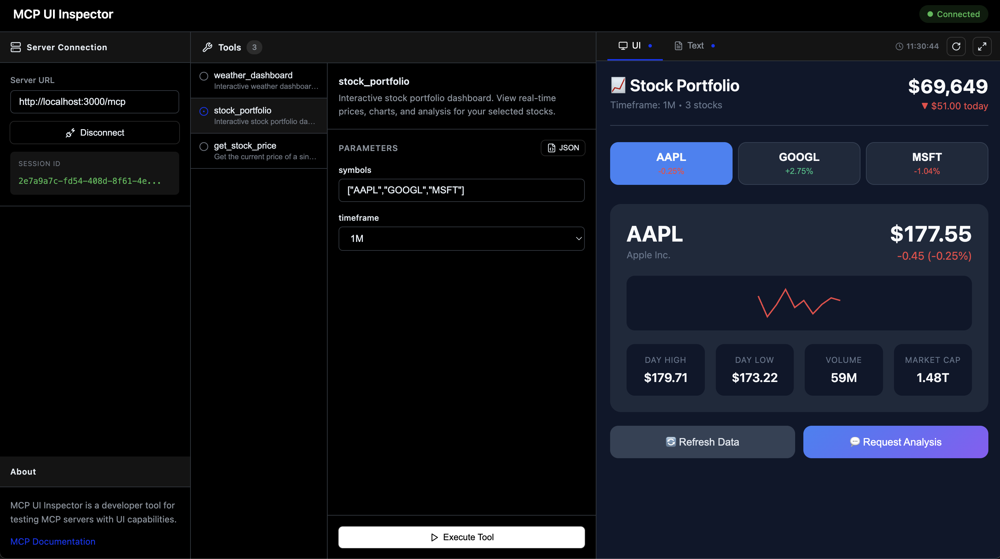

# MCP UI Kit


Build interactive React UIs for MCP tools.

The [Model Context Protocol (MCP)](https://modelcontextprotocol.io/) enables AI assistants to interact with external tools and data. The [mcp-ui](https://github.com/anthropics/mcp-ui) project extends this with rich, interactive UI components that can be rendered directly in the AI chat.

**mcp-ui-kit** simplifies building these UI components by:

- **Bundling on-demand** — Write React components, they're bundled automatically when the tool is called
- **Zero config** — No webpack/vite setup needed, just `createUI()` and point to your `.tsx` file
- **Props from server** — Pass data from your MCP tool directly to React via `useProps()`
- **Two-way communication** — Components can `sendPrompt()` to the AI or `callTool()` to invoke other MCP tools

Built on top of [@mcp-ui/server](https://www.npmjs.com/package/@mcp-ui/server).

## Installation

```bash
npm install mcp-ui-kit @modelcontextprotocol/sdk
```

## Server Usage

Create UI components that bundle on-demand within your MCP server:

```typescript
import { McpServer } from '@modelcontextprotocol/sdk/server/mcp.js';
import { StdioServerTransport } from '@modelcontextprotocol/sdk/server/stdio.js';
import { createUI } from 'mcp-ui-kit/server';  // 👈 mcp-ui-kit

// Create the MCP server
const server = new McpServer({
  name: 'my-server',
  version: '1.0.0'
});

// Create a UI component                        // 👈 mcp-ui-kit
const dashboardUI = createUI(                   // 👈 mcp-ui-kit
  'my-dashboard',                               // 👈 mcp-ui-kit
  import.meta.resolve('./MyComponent.tsx')      // 👈 mcp-ui-kit
);                                              // 👈 mcp-ui-kit

// Register a tool with the UI
server.registerTool(
  'dashboard',
  {
    description: 'Interactive dashboard',
    _meta: dashboardUI.meta                     // 👈 mcp-ui-kit
  },
  async () => ({
    content: [
      { type: 'text', text: 'Dashboard loaded' },
      await dashboardUI.component({             // 👈 mcp-ui-kit
        props: { title: 'Hello' },              // 👈 mcp-ui-kit
        frameSize: ['700px', '500px']           // 👈 mcp-ui-kit
      })                                        // 👈 mcp-ui-kit
    ]
  })
);

// Start the server
const transport = new StdioServerTransport();
await server.connect(transport);
```

### With Input Schema

Tools can accept parameters via `inputSchema` and pass them to your UI component:

```typescript
import { z } from 'zod';
import { createUI } from 'mcp-ui-kit/server';  // 👈 mcp-ui-kit

const stockUI = createUI('stocks', import.meta.resolve('./StockDashboard.tsx'));  // 👈 mcp-ui-kit

server.registerTool(
  'stock_portfolio',
  {
    description: 'View stock portfolio with charts',
    _meta: stockUI.meta,                                             // 👈 mcp-ui-kit
    inputSchema: {
      symbols: z.array(z.string()).default(['AAPL', 'GOOGL']),
      timeframe: z.enum(['1D', '1W', '1M', '1Y']).default('1M'),
    },
  },
  async ({ symbols, timeframe }) => ({
    content: [
      { type: 'text', text: `Showing ${symbols.join(', ')} for ${timeframe}` },
      await stockUI.component({                                      // 👈 mcp-ui-kit
        props: { symbols, timeframe },                               // 👈 mcp-ui-kit (params → props)
      })
    ]
  })
);
```

## Client Usage

Helper functions for your React components (the ones you pass to `createUI`):

```tsx
// StockDashboard.tsx
import { useState } from 'react';
import { sendPrompt, callTool, useProps } from 'mcp-ui-kit/ui';  // 👈 mcp-ui-kit

function StockDashboard() {
  const [analysis, setAnalysis] = useState<string | null>(null);
  
  // Get props passed from server (matches inputSchema params)        // 👈 mcp-ui-kit
  const { symbols, timeframe } = useProps({                           // 👈 mcp-ui-kit
    symbols: ['AAPL'],                                                // 👈 mcp-ui-kit
    timeframe: '1M'                                                   // 👈 mcp-ui-kit
  });                                                                 // 👈 mcp-ui-kit

  const handleAnalyze = (symbol: string) => {
    // Send a message to the AI chat                                  // 👈 mcp-ui-kit
    sendPrompt(`Analyze ${symbol} stock performance over ${timeframe}`);  // 👈 mcp-ui-kit
  };

  const handleRefresh = async (symbol: string) => {
    // Call another MCP tool                                          // 👈 mcp-ui-kit
    callTool('get_stock_price', { symbol });                          // 👈 mcp-ui-kit
  };

  return (
    <div>
      <h1>Stock Portfolio ({timeframe})</h1>
      {symbols.map(symbol => (
        <div key={symbol}>
          <span>{symbol}</span>
          <button onClick={() => handleAnalyze(symbol)}>
            Ask AI to Analyze
          </button>
          <button onClick={() => handleRefresh(symbol)}>
            Refresh Price
          </button>
        </div>
      ))}
    </div>
  );
}
```

## MCP UI Inspector

The MCP UI Inspector is a developer tool for testing MCP servers with UI capabilities. It provides a visual interface to:

- **Connect to MCP servers** — Enter your server URL and establish a connection
- **Browse available tools** — See all registered tools and their descriptions
- **Configure parameters** — Fill in tool input schemas with a form UI or raw JSON
- **Execute tools** — Run tools and see both text and UI responses
- **Preview UI components** — View your React components rendered in real-time with full interactivity



The inspector makes it easy to iterate on your UI components without needing a full AI chat client. You can test `sendPrompt()` and `callTool()` interactions, verify props are passed correctly, and debug your components in isolation.

## API

### Server (`mcp-ui-kit/server`)

**`createUI(name, entryUrl)`** - Creates a UI component
- `name`: Component identifier (used in the `ui://` URI)
- `entryUrl`: Path to the component entry file
- Returns: `{ meta, component(opts?) }`
  - `meta`: Object to spread into tool's `_meta` for UI resource linking
  - `component(opts?)`: Async function returning the UI resource
    - `opts.props`: Data to pass to your React component
    - `opts.frameSize`: `[width, height]` e.g. `['700px', '500px']`

The `entryUrl` parameter accepts both formats:

```typescript
// ESM (recommended) - using import.meta.resolve()
createUI('dashboard', import.meta.resolve('./MyComponent.tsx'));

// CommonJS - using require.resolve() or absolute paths
createUI('dashboard', require.resolve('./MyComponent.tsx'));
createUI('dashboard', path.join(__dirname, './MyComponent.tsx'));
```

### UI (`mcp-ui-kit/ui`)

- **`useProps(defaults)`** - Get props passed from the server via `component({ props })`
- **`sendPrompt(message)`** - Send a message to the AI chat
- **`callTool(name, params)`** - Invoke an MCP tool

## Development

```bash
npm install
npm run dev:all  # Start demo server + inspector
```
